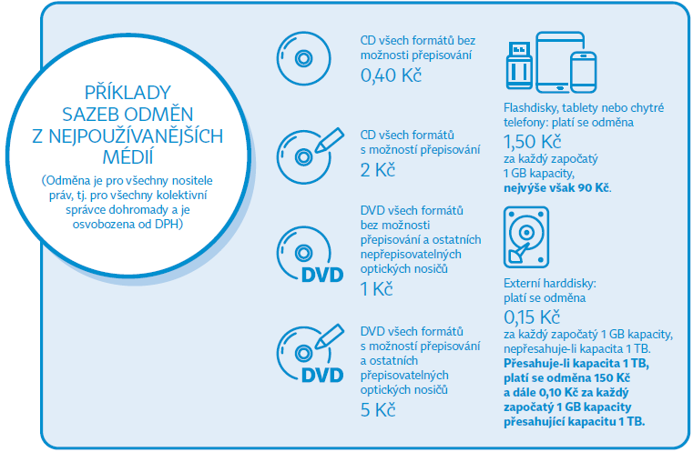

To jsem si takhle nad ránem brouzdal internet, popíjel kafe a zavítal na jednu z mých oblíbených sociálních sítí: [Reddit](reddit.com), kde existuje komunita pro Čechy pod subredditem [r/czech](reddit.com/r/czech). Zaujal mě jeden příspěvek, konkrétně novela autorského zákona z roku 2021. Budu vycházet z této [webovky](https://www.osa.cz/novela/clanky-a-videa/nahradni-odmeny-neboli-poplatky-z-prazdnych-medii/). 

Protože jsem doposud o takové věci ještě nevěděl, její obsah mě docela zarazil. *Proč já vlastně mám platit někomu, když jeho majetek ani nevlastním?!*

## O co jde?

Začneme hezky popořadě. [OSA](https://www.osa.cz/kdo-jsme/o-nas/) je Ochranný svaz autorský, který má zákonné oprávnění licencovat veřejné hudební produkce a vybírat za ně poplatky.
Většinou se jedná o:
- Rádio, televize
- Streamovací služby (Spotify, YouTube, Apple Music...)
- Živá vystoupení
- Pouštění hudby ve provozovnách (restaurace, fitka, obchody...)
- Reprodukovaná hudba na akcích (firemní večírky, svatby...)

Z těhle věcí pak vybírá nějaké poplatky a rozděluje je autorům podle toho, kolikrát a kde byla jejich díla použitá. Důležité je taky vypíchnout to, že OSA licencuje práva hlavně k **veřejnému provozování, rozmnožování, rozšiřování** a k těmhle právům se ještě dostanu. 

## Jak OSA vybírá peníze? 

Cituju sice článek z roku 2018, ale jeho obsah je podle mě pořád aktuální.

> OSA funguje prakticky tak, že od občanů, podnikatelů, obcí, pořadatelů a dalších fyzických i právnických osob vybírá poplatky pro autory, které zastupuje (za členský poplatek). Vydělá si touto cestou cca 1 mld. korun ročně, 200 milionů jde na provoz této poměrně mocné společnosti a přes 800 milionů se pošle autorům a nakladatelům do Česka i zahraničí. 

*zdroj: [finance.cz](https://www.finance.cz/515576-osa-poplatky/)*

V tom samém zdroji je taky zmiňováno, že se vybíral poplatek za diskotéky, filmové festivaly, hody apod. Tohle by ještě šlo. Novela z roku 2021 tomu hodila slušný vidle. Poplatek se "nově" vztahuje i na pevné disky, flashky nebo cédečka. Cože?

## Co se změnilo?

Nemám to autorům za zlé – chápu, že i umělec musí z něčeho žít. S čím ale mám problém, je vyloženě tento obrázek: 



a hlavně jejich argumentace: 

> Dle litery autorského zákona se jedná o „právo (autora či jiného nositele práv) na odměnu v souvislosti s rozmnožováním díla pro osobní potřebu“.
> Jinými slovy, kdokoliv z nás si může udělat kopii, nebo dokonce neomezené množství kopií svého oblíbeného filmu nebo alba své oblíbené kapely a nepotřebuje k tomu souhlas žádného autora, umělce nebo snad kolektivního správce. Kopie smíme pořizovat pro sebe nebo například rodinné příslušníky.

> Když budu chtít další rohlík, musím si ho rovněž koupit. Když si budu chtít udělat kopii alba The Wall od skupiny Pink Floyd pro svého sourozence, do auta nebo na chalupu, nemusím si kupovat nový originál, prostě si ho mohu vypálit na prázdné CD nebo nahrát do počítače. A nepotřebuji k tomu souhlas ani kapely, ani autorů a ani nahrávací společnosti. Poplatek neboli náhradní odměna v rozumné míře kompenzuje tuto újmu umělcům a výrobcům.

> Při současné úrovni a dostupnosti moderních reprodukčních technologií lze dokonce říci, že každá kopie bude mít zvukovou kvalitu originálu. Ke ztrátě kvality zvuku tak nedochází ani u třetí nebo další kopie, na rozdíl od toho, když se v 80. letech pořizovaly kopie nahrávek na magnetofonové pásky.

*zdroj: [OSA webovky](https://www.osa.cz/novela/clanky-a-videa/nahradni-odmeny-neboli-poplatky-z-prazdnych-medii/)*

Pojďme si to spočítat. Doma mám třeba obyčejný 2TB harddisk. Místo toho abych to nějak složitě zadával do kalkulačky, jsem prostě napsal krátký kód:

```py
CAPACITY_THRESHOLD_GB = 1000
BASE_PRICE_UNDER_THRESHOLD = 0.15  # per GB
PRICE_PER_GB_OVER_THRESHOLD = 0.10  # per GB
BASE_FEE_FOR_FIRST_1000_GB = 150  # flat fee for 1000 GB

disk_capacity_gb = 950

if disk_capacity_gb > CAPACITY_THRESHOLD_GB:
    extra_gb = disk_capacity_gb - CAPACITY_THRESHOLD_GB
    total_price = BASE_FEE_FOR_FIRST_1000_GB + (extra_gb * PRICE_PER_GB_OVER_THRESHOLD)
else:
    total_price = disk_capacity_gb * BASE_PRICE_UNDER_THRESHOLD

print(f"Total price is {total_price} Kč")

>>> "Total price is 142.5 Kč"
```

Takže to je nějak takto: 

| Kapacita | Cena (Kč) |
| :------- | --------: |
| 1TB | 150.00 |
| 2TB  | 250.00 |
| 4TB  | 450.00 |
| 8TB  | 850.00 |
| 10TB | 1050.00 |

Jasně, nejsou to žádné závratné částky — pár korun za HDD. S čím mám ale osobně problém je hlavně absolutní netransparentnost celého systému a předpoklad, že koncový uživatel bude podvádět. Ten argument je absurdní. Vybírají peníze s tím, že očekávají, že nějakým způsobem ohneš zákon a budeš si stahovat hudbu/software nelegální cestou. Tohle *je* **presumpce viny**. Náš právní stát doslova stojí na **presumpci neviny**, tedy - dokud nedokážeme že jsi něco proved, jsi nevinný do té doby. 

Pokaždé, když si koupím disk, někdo mi automaticky strhne daň za něco, co jsem možná ani neudělal. Ty peníze jdou bůhvíkam. A ještě mi mezi řádky tvrdí, že jsem pravděpodobně vinen – i když na disku třeba nemám ani MP3. Jak poznají, co na disku mám? Jak zaručí, že peníze dostane ten správný autor? Co neslyšící lidé? Oni doslova nebudou poslouchat tu hudbu už jen z principu a budou také platit za nelegální obsah, protože tam je nějaké *hypotetické porušení zákona*? 

Když už jsme u toho: co vývojáři? Každý `import` nebo `clone` je přece taky forma využití duševního vlastnictví. Nikdo neúčtuje SSDčka nebo HDDčka protože na nich pravděpodobně běží nějaký kód, který má také nějaké duševní vlastnictví. 

## Jiná řešení 

Dneska máme na výběr z množství streamovacích služeb a legálních způsobů, jak si hudbu koupit. Přijde mi docela zavádějící, že se pořád platí paušální poplatky za nosiče dat, bez ohledu na to, jestli na nich vůbec hudba je. Místo plošného daňování by možná dával smysl cílený dohled na organizátory akcí, jestli pouštějí legální hudbu. Ale všichni víme jak se náš stát v otázkách informatiky k věci staví. 

Možná se toho jednou dočkáme, ale zatím to vypadá, že půjdeme pořád stejnou cestou.

### Závěrem...

No, štve mě to. A pokud jste dočetli až sem, vás asi taky